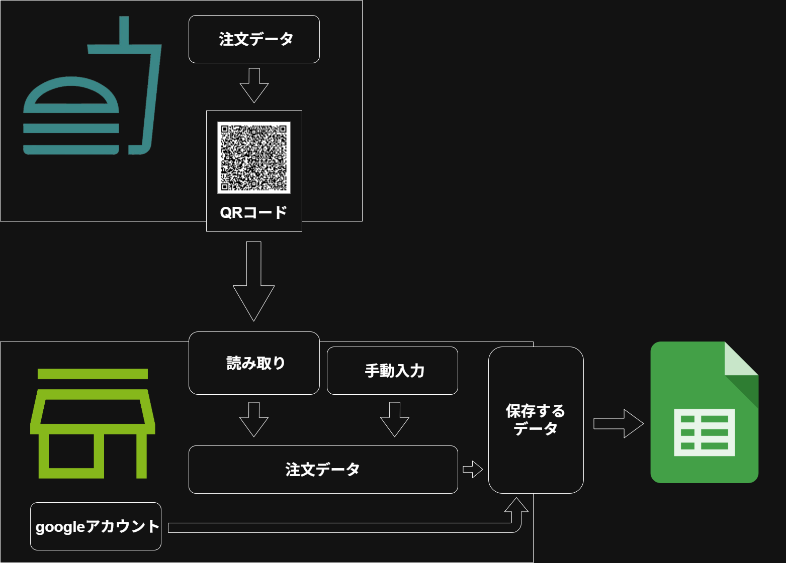
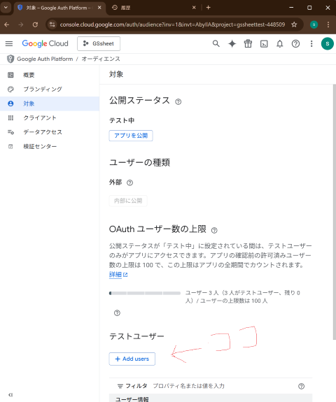
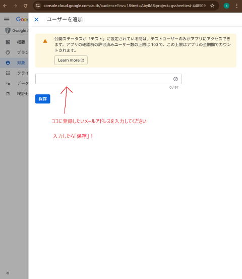
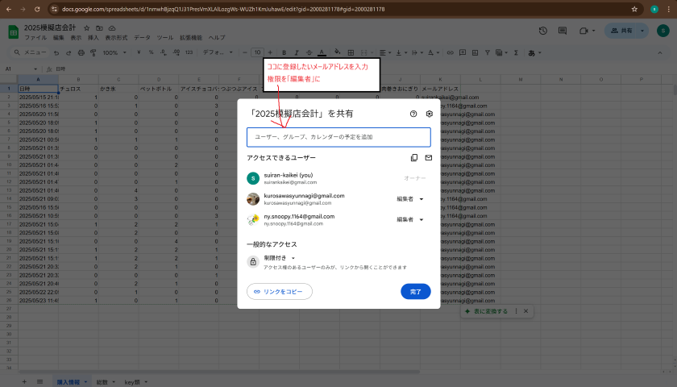

初めまして。[nAgI314](https://github.com/nAgI314) と、いつもの [mint73](https://github.com/mint73) です。

この資料では、模擬店会計アプリケーションの2025年版・店舗側の使い方を書いていきます。

模擬店会計アプリ: <https://sell.suiranfes.blue/>

### どんなアプリなのか
こんなアプリです()

試すのが早いので、まずは試してみましょう。

1. [模擬店会計アプリ](https://sell.suiranfes.blue/)を開き、画面右下の人のマークから、ログインページに行き、Google アカウントにログイン

2. [コチラのアプリ(お客さんが使う方)](https://shop.suiranfes.blue/)を開いて注文を入力して、QR コードを表示させる。

3. [模擬店会計アプリ](https://sell.suiranfes.blue/)のカメラでその QR コードを読み取る。

4. 表示された注文内容を確認し、受け取った金額を「入力金額」欄に入力。お釣りがあれば確認してお客さんに渡す。

5. 注文に問題がなければ、画面下部の「データを保存」ボタンを押す。

良くできました！！

これで、注文のデータが[スプレッドシート](https://docs.google.com/spreadsheets/d/1nmwhBjzqQ1J31PresVmXLAlLozgWs-WUZh1KmJuhawE/edit?gid=2000281178#gid=2000281178)に保存されたはずです。

このスプレッドシートを見て、売上をリアルタイムに監視したり、何の食券が何個売れたのかを調べることで、何の商品が足りなくなりそうなのかを事前に調べたりすることができます。

また、ちょっと頑張れば、その時に人気になっている商品をボードか何かに書いてお客さんに見えるようにすることで、購買意欲を引き立てられるかもしれません！

### 使い方(詳細)

模擬店班チーフは、以下の「設定」を行ってください。

#### 設定

1. suirankaikei@gmail.com にログイン
2. [Google Cloud のオーディエンス](https://console.cloud.google.com/auth/audience?inv=1&invt=Abx3Qw&project=gssheettest-448509)を開き、下の方にある「Add user」をクリック

3. 当日アプリを使用する人の Google アカウントを登録

4. [スプレッドシート](https://docs.google.com/spreadsheets/d/1nmwhBjzqQ1J31PresVmXLAlLozgWs-WUZh1KmJuhawE/edit?gid=2000281178#gid=2000281178)の共有設定でも、当日アプリを使用する人の Google アカウントに編集を許可

#### 当日

さっき試してみたように使えば OK！

##### 備考

* 注文を入力するアプリを使ってないお客さんからは、口頭で注文を聞いて、電卓ページで入力します
* 間違ったデータを保存してしまったら、データページの下部にある表から消したいデータを探し、ゴミ箱ボタンを押すと消えます
* インターネット接続が不安定になると、データを送信できなくなるかもしれません。その時は、アプリのデータページを見ると、「共有」が×の行ができるので、後でインターネットが安定したら、画面上部の「共有できていないデータを再送信」ボタンを押しましょう
* [スプレッドシート](https://docs.google.com/spreadsheets/d/1nmwhBjzqQ1J31PresVmXLAlLozgWs-WUZh1KmJuhawE/edit?gid=2000281178#gid=2000281178)は、「購入情報」のシートを壊さなければ何をしても大丈夫です(もし消してしまったら、同じ名前のシートを作れば大丈夫ですが、それまでのデータはすべて消えます)
* データの保存がうまくいかなかったりしているときは、ログインしているかを確認してください
* 【重要】同じ端末で違うアカウントにログインすることは推奨しません。データが破損します
