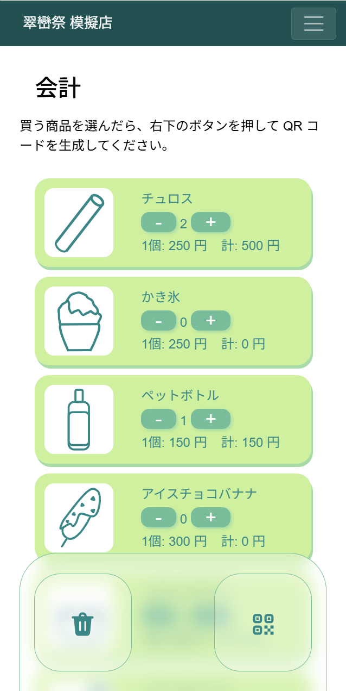
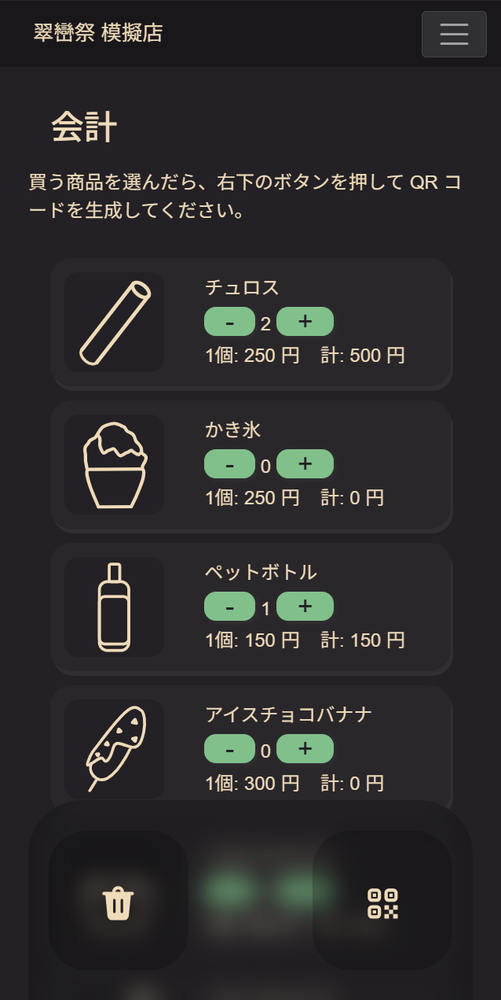
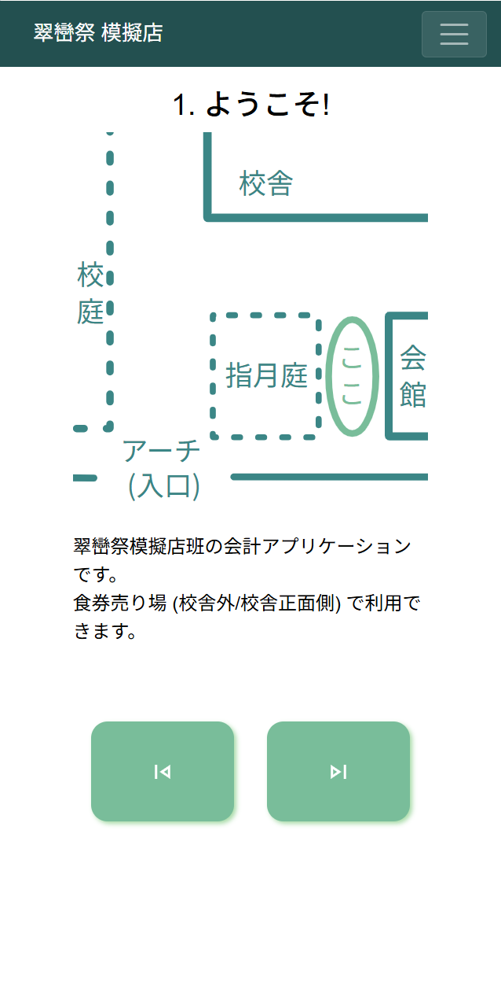
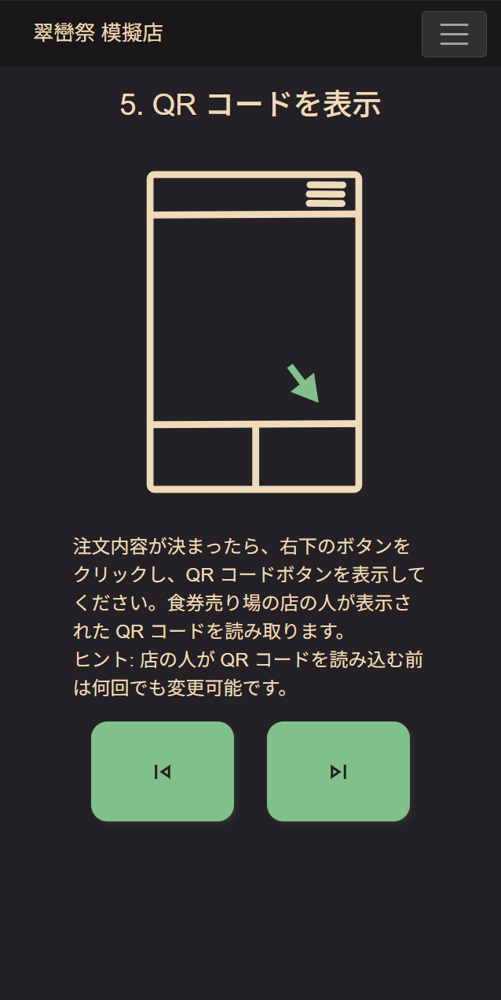
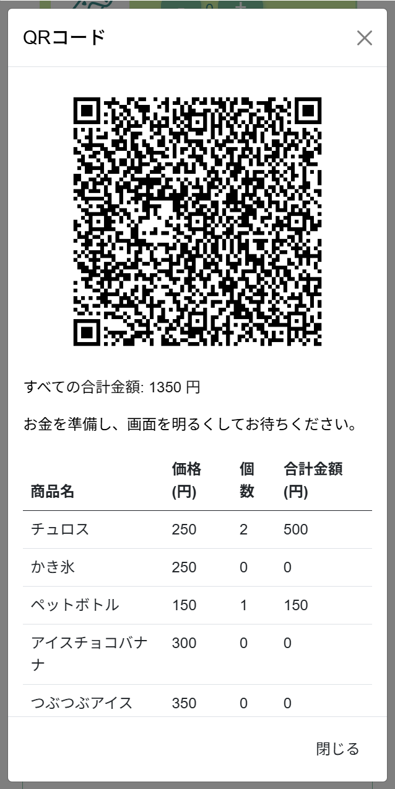
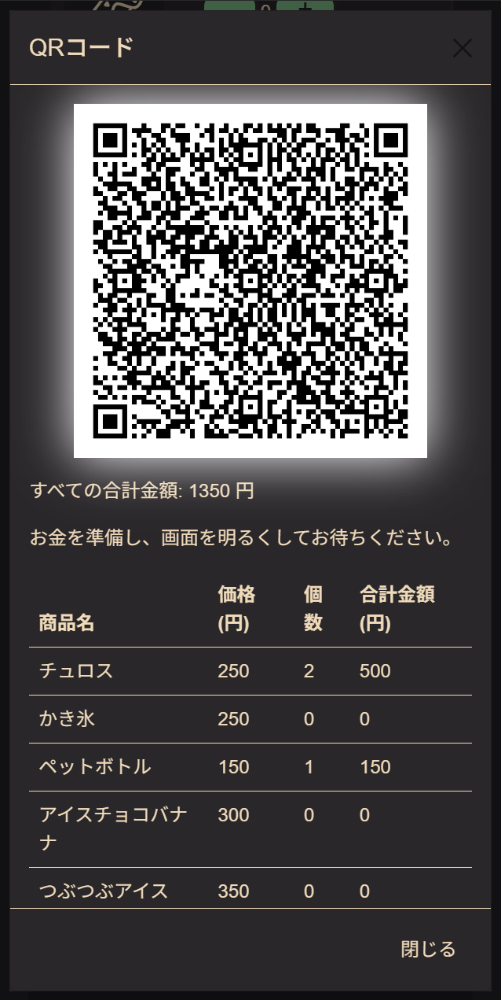

こんにちは。高崎高校を卒業した [mint73](https://github.com/mint73) (元・食堂喫茶店班) です。

## 雑談

卒業までに引き継ぎが終わっていなかったので、今更 (5月) 作成しております。~~今月末に翠巒祭のはずですが、間に合うのでしょうか…?~~ なんとか間に合いそうです。よかった。

店側のアプリケーションの開発は、相方の [nAgI314](https://github.com/nAgI314) が頑張ってくれていました。ありがとう!!

## 概要

さて、そろそろ本題に入りましょう。

本資料は、お客様視点のアプリケーションの使い方について記述します。(私が作ったアプリケーションのほうです!)

ウェブサイトやパンフレット作成に役立ててください。~~(今更すぎて、間に合わないかもしれませんが…)~~

## 結論

看板に書くこと・呼びかけてほしいこと (まとめ)

- アプリケーションが使えること (+アプリケーションの QR コード)
- 今まで通りの、口頭でも会計できること
- 並んでいる間に財布・お金を用意してほしいこと

## 使い方

自分が客側だと思って、以下の文章を読むとイメージや準備しやすいと思います。

利用するアプリケーションはこちらです: <https://shop.suiranfes.blue/>

<!--

-->

<!--
ちなみに、このアプリケーションは列が長いときに有効的で、列がほとんどないときは口頭のほうが早いです。
-->

### 案内

事前にこのアプリケーションの存在を知っているお客様は殆どいないと思います。

そのため、**模擬店付近に看板を設置**し、独自アプリケーションが利用できること、その**アプリケーションの QR コード**、簡単な使い方 (詳細はアプリケーション内に書いてあるので、おそらく不要です) を書いてください。(雨天時を想定し、ビニール袋を用意するか被せておくと良いかもしれません)

また、混んでいるときは、アプリケーションについて、模擬店班員から声がけしてもらえると嬉しいです。

スマホがないお客さんや、使うのが苦手なお客さんには、今まで通り**口頭での注文ができる**ことを伝え、紙のメニューを渡しましょう。

### 列に並ぶ・アプリケーションを使う

**アプリケーション内に説明ページがあります**。やや文章が長いですが、大抵のお客様は理解できると思います。

<!--

-->

(使い方がわかっていなさそうだったら、口頭で聞いてもらっても構いません)

**並んでいる間に財布・お金を用意してもらえると嬉しいです**。(これについても、看板に書いたり、班員が声がけするとよいです。おそらくこれが会計で、一番時間を使います)

### QR コードを読み取ってもらう

お客様は、**QR コードを読み取って**もらい、用意しておいた**お金**と、模擬店班員が用意している**食券**を**交換**します。

<!--

-->

(先述しましたが、QR コード、お金を先に用意してもらえると、非常にスムーズに進みます)

## 最後に

私たちのシステムが今年も使ってもらえるのは、非常に嬉しいです。

頑張ってください!!
