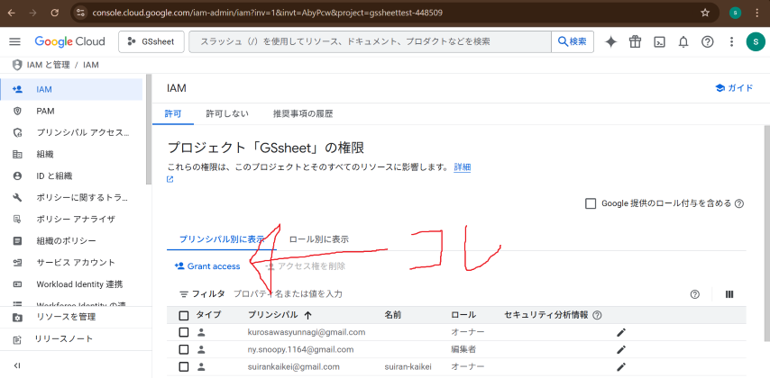
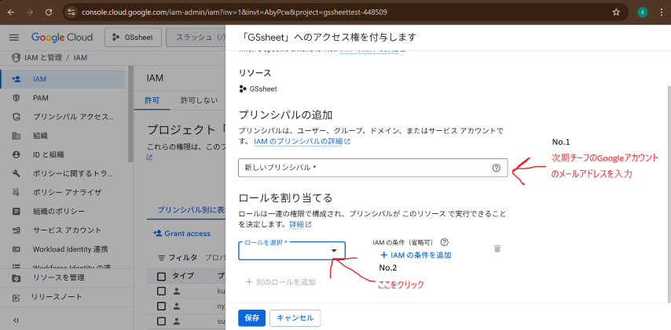

どうも、[mint73](https://github.com/mint73) と [nAgI314](https://github.com/nAgI314) です。

この資料では、模擬店会計アプリケーションの引き継ぎ方法について書いています。

## 引継ぎについて

翠巒祭が終わったら、模擬店班チーフは次の年のために引継ぎをしましょう。

### Spread Sheet 関係

1. [Google Cloud のオーディエンス](https://console.cloud.google.com/auth/audience?inv=1&invt=Abx3Qw&project=gssheettest-448509)を開き、下の方にある「ユーザー情報」の表から、その年に登録したアカウントを削除します
削除はそれぞれの行のゴミ箱ボタンからできます
2. 次の年のチーフが班員のアカウントを登録できるように、このプロジェクトの「オーナー」にします。  
   1. [Google Cloud の IAM](https://console.cloud.google.com/iam-admin/iam?inv=1&invt=AbyOEA&project=gssheettest-448509) を開き、Grant Access を押します
      
   2. 「新しいプリンシパル」に次期チーフの Google メールアドレスを入力し、「ロール」でオーナーを選択したら保存  
      
      
3. スプレッドシートの「購入情報」のデータは、別のシートに移すなど、情報が混ざってしまわないようにしましょう  
   ※1行目の「日時、チュロス、...」は消さないでください。

### 品物の値段を変更・品物を追加する

1. はじめに、[GitHub](https://github.com) というサービスにアクセスします。  
   
1. ページ右上の `Sign in` をクリックし、サインイン情報を入力してください。(上がメールアドレス、下がパスワード)  
   アカウントに関しては、引き継ぎしているはずなので、その資料をご確認ください。  
   
1. はじめの利用では、デバイスの認証が必要となります。  
   翠巒祭のメール (Gmail) に認証キーが来ていますので、そちらを入力してください。  
   
1. 次のページが表示されたら、ログインに成功しています。  
   
1. 続いて、[模擬店データ](https://github.com/suiranfes/mock-store-datas)にアクセスしてください。  
   
1. 先程のページで、<kbd>.</kbd> (ピリオド) を入力すると、編集ページに移動できます。  
   (または <https://github.dev/suiranfes/mock-store-datas> にアクセスしてください)  
   
1. ページ左のファイルの中から `products.json` をクリックし、中央の画面で編集できます。
1. 編集については、Json という形式を利用しており、見てわかるような感じです。
   ```json
   [
     {
       "itemName": "商品1", // 商品名
       "itemPrice": 100, // 値段
       "itemImage": "sample-data/icons/01.svg" // アイコン (ない場合は、""のように、空欄にしてください)
     },
     {
       "itemName": "商品2", // 商品名
       "itemPrice": 150, // 値段
       "itemImage": "" // アイコン (ない場合は、""のように、空欄にしてください)
     },
     {
       "itemName": "商品3", // 商品名
       "itemPrice": 200, // 値段
       "itemImage": "" // アイコン (ない場合は、""のように、空欄にしてください)
     } // 最後はカンマ (,) なし
   ]
   
   ```
1. アイコンに関しては、独自で作成しており、[こちら](https://github.com/suiranfes/shop.suiranfes.blue/tree/3c6026aebe3bb4f2f3a6a6c86e6acb5c77821b77/suiran/wwwroot/sample-data/icons)の10種類 (うち、9種類は利用中) しか利用できません。アイコンを自作するのは大変なため、なし (`""`) にすると良いでしょう。
