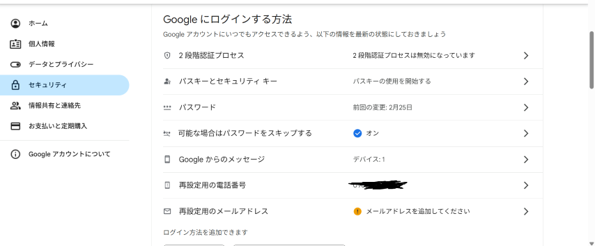
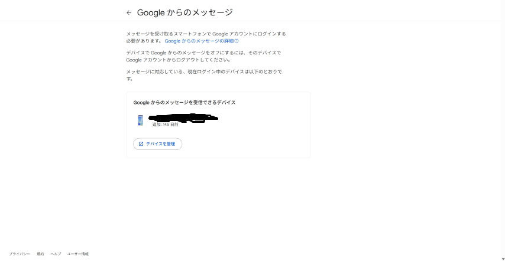
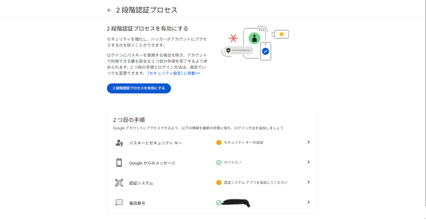
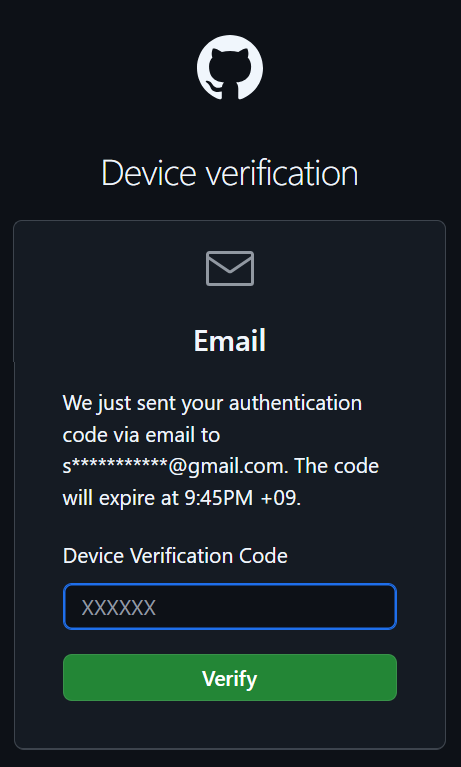
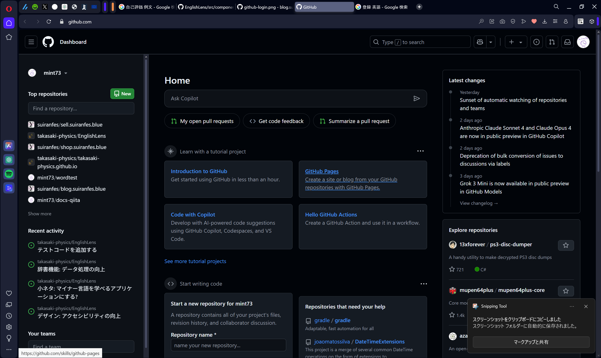
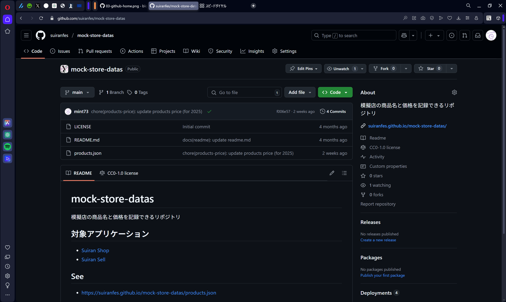
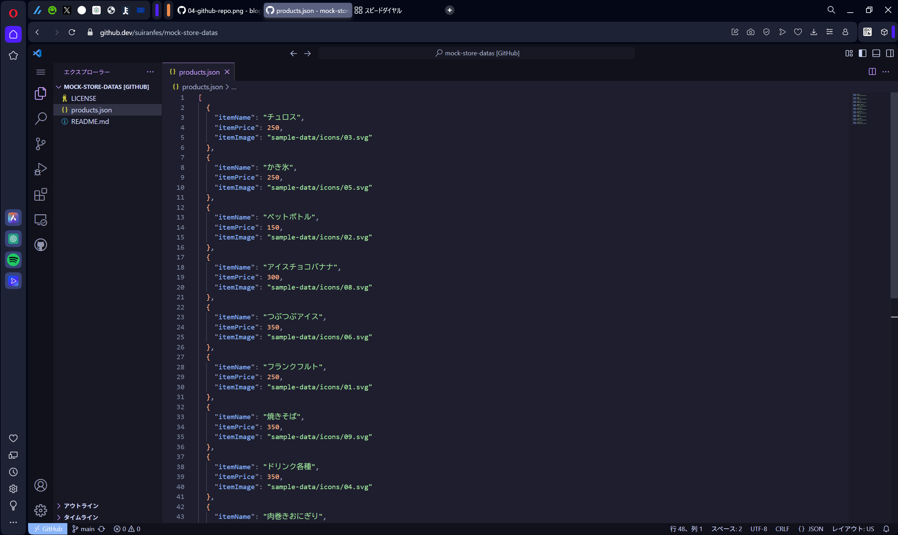

どうも、[mint73](https://github.com/mint73) と [nAgI314](https://github.com/nAgI314) です。

この資料では、模擬店会計アプリケーションの引き継ぎ方法について書いています。

## 引継ぎについて

翠巒祭が終わったら、模擬店班チーフは次の年のために引継ぎをしましょう。

### Spread Sheet 関係

1. [Google Cloud のオーディエンス](https://console.cloud.google.com/auth/audience?inv=1&invt=Abx3Qw&project=gssheettest-448509)を開き、下の方にある「ユーザー情報」の表から、その年に登録したアカウントを削除します  
   削除はそれぞれの行のゴミ箱ボタンからできます
1. スプレッドシートの「購入情報」のデータは、別のシートに移すなど、情報が混ざってしまわないようにしましょう  
   ※1行目の「日時、チュロス、...」は消さないでください。
1. 【重要】Google アカウント (suirankaikei@gmail.com) を次期チーフに引き継ぐ
   上の代から引き継ぐ方法も書いて行きます。  
   この作業は、前チーフと次期チーフが互いに連絡を取れる状態にしてから行ってください
   1. 前チーフはアカウントの2段階認証を無効にする
   1. 次期チーフは Google アカウント (suirankaikei@gmail.com) にログインする  
      ※前チーフのスマホに確認が届いたら、OK する
    　番号を入力するよう言われたら正しいものを押す
   1. Googleからのメッセージを受信できるデバイスを変更する
      1. Googleアカウントの設定からセキュリティを開き、下の画面にする
    
      1. 「Googleからのメッセージ」を押して、下のようになったら「デバイスを管理」
   
   ログインしたことがあるデバイスがすべて表示されるので、前チーフのスマホを選んで、ログアウトさせる。その後、もう一度上の画面を開いて、次期チーフのスマホが表示されれば成功です
   これをしないと、次の引継ぎに支障が出るので必ずやりましょう
   1. 次期チーフは2段階認証を設定する
      1. もう一度、ⅲ-aの画面を開き、 2段階認証プロセスを押して下の画面にする  
      
      1. 電話番号を押して、次期チーフの物を追加、前チーフの物を削除
      1. 「2段階認証プロセスを有効にする」 を押して有効化  
      ※有効化しないと、アプリがうまく動かない可能性があります 

### 品物の値段を変更・品物を追加する

1. はじめに、[GitHub](https://github.com) というサービスにアクセスします。  
   
1. ページ右上の `Sign in` をクリックし、サインイン情報を入力してください。(上がメールアドレス、下がパスワード)  
   アカウントに関しては、suirankaikei@gmail.comのスプレッドシートにある「githubアカウント情報」をご確認ください。  
   
1. はじめの利用では、デバイスの認証が必要となります。  
   翠巒祭のメール (Gmail) に認証キーが来ていますので、そちらを入力してください。  
   
1. 次のページが表示されたら、ログインに成功しています。  
   
1. 続いて、[模擬店データ](https://github.com/suiranfes/mock-store-datas)にアクセスしてください。  
   
1. 先程のページで、<kbd>.</kbd> (ピリオド) を入力すると、編集ページに移動できます。  
   (または <https://github.dev/suiranfes/mock-store-datas> にアクセスしてください)  
   
1. ページ左のファイルの中から `products.json` をクリックし、中央の画面で編集できます。
1. 編集については、Json という形式を利用しており、見てわかるような感じです。
   ```json
   [
     {
       "itemName": "商品1", // 商品名
       "itemPrice": 100, // 値段
       "itemImage": "sample-data/icons/01.svg" // アイコン (ない場合は、""のように、空欄にしてください)
     },
     {
       "itemName": "商品2", // 商品名
       "itemPrice": 150, // 値段
       "itemImage": "" // アイコン (ない場合は、""のように、空欄にしてください)
     },
     {
       "itemName": "商品3", // 商品名
       "itemPrice": 200, // 値段
       "itemImage": "" // アイコン (ない場合は、""のように、空欄にしてください)
     } // 最後はカンマ (,) なし
   ]
   
   ```
1. アイコンに関しては、独自で作成しており、[こちら](https://github.com/suiranfes/shop.suiranfes.blue/tree/3c6026aebe3bb4f2f3a6a6c86e6acb5c77821b77/suiran/wwwroot/sample-data/icons)の10種類 (うち、9種類は利用中) しか利用できません。アイコンを自作するのは大変なため、なし (`""`) にすると良いでしょう。
